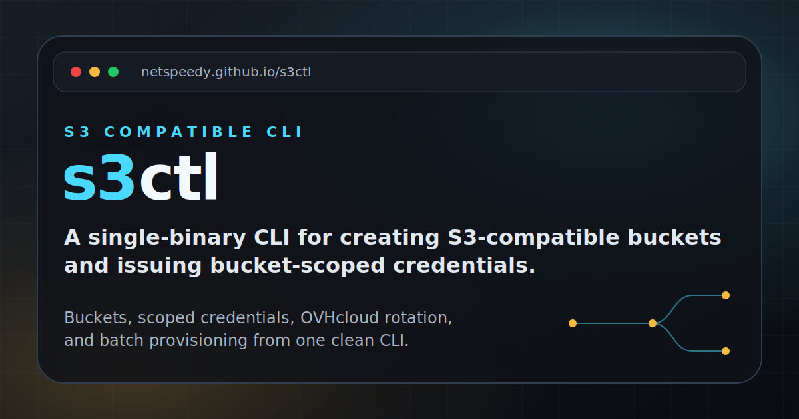

<p align="center">
  
</p>

<h1 align="center">homebrew-s3ctl</h1>

<p align="center">
  Homebrew tap for <a href="https://github.com/netspeedy/s3ctl"><strong>s3ctl</strong></a> — a single-binary CLI for creating S3-compatible buckets and issuing bucket-scoped credentials.
</p>

<p align="center">
  <a href="https://github.com/netspeedy/s3ctl/releases"></a>
  <a href="LICENSE"></a>
  <a href="https://github.com/netspeedy/homebrew-s3ctl"></a>
  <a href="https://github.com/netspeedy/s3ctl"></a>
  <a href="https://buymeacoffee.com/soakes"></a>
</p>

---

## Install

```bash
brew tap netspeedy/s3ctl
brew install s3ctl
```

> On recent Homebrew, new third-party taps require explicit trust. If installation is refused, run `brew trust netspeedy/s3ctl` once, then `brew install s3ctl`.

Plan a bucket without making changes:

```bash
s3ctl \
  --bucket app-data \
  --endpoint https://objects.example.com \
  --region us-east-1 \
  --dry-run
```

## Available formulae

| Formula | Description |
|---|---|
| [`s3ctl`](Formula/s3ctl.rb) | S3-compatible bucket provisioning and scoped-credential CLI |

## About this tap

This repository only packages the formula at [`Formula/s3ctl.rb`](Formula/s3ctl.rb). It is updated automatically on each [s3ctl release](https://github.com/netspeedy/s3ctl/releases). For source code, issues, and documentation, see the [main repository](https://github.com/netspeedy/s3ctl).

## License

Copyright © 2026 [Simon Oakes](https://github.com/soakes). Released under the [MIT License](LICENSE).

This tap only packages the [s3ctl](https://github.com/netspeedy/s3ctl) formula, an unofficial community tool that is not affiliated with, endorsed by, or sponsored by AWS, Amazon S3, or OVHcloud.
