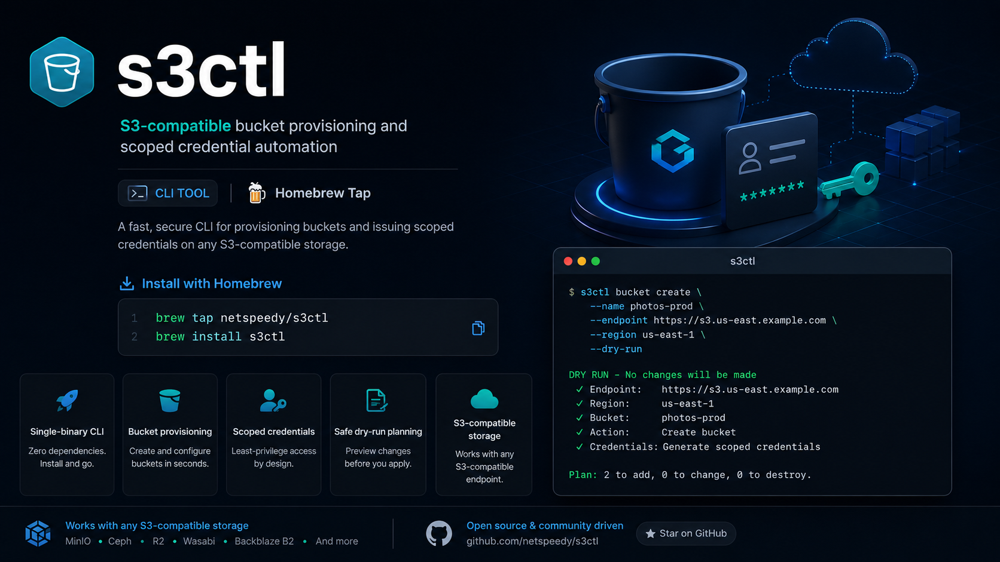

<p align="center">
  
</p>

<p align="center">
  
</p>

<h1 align="center">s3ctl</h1>

<p align="center">
  <strong>S3-compatible bucket provisioning and scoped credential automation</strong>
</p>

<p align="center">
  Homebrew tap for <a href="https://github.com/netspeedy/s3ctl"><strong>s3ctl</strong></a> — a single-binary CLI for creating S3-compatible buckets and issuing bucket-scoped credentials.
</p>

<p align="center">
  <a href="https://github.com/netspeedy/s3ctl/releases"></a>
  <a href="LICENSE"></a>
  <a href="https://github.com/netspeedy/homebrew-s3ctl"></a>
  <a href="https://github.com/netspeedy/s3ctl"></a>
</p>

<p align="center">
  <a href="#install">Install</a> •
  <a href="#dry-run-planning">Dry run</a> •
  <a href="#key-features">Features</a> •
  <a href="#available-formulae">Formulae</a> •
  <a href="#license">License</a>
</p>

---

## Install

Install `s3ctl` using Homebrew:

```bash
brew tap netspeedy/s3ctl
brew install s3ctl
```

> [!NOTE]
> On recent Homebrew versions, new third-party taps may require explicit trust.
> If installation is refused, run `brew trust netspeedy/s3ctl` once, then install again.

```bash
brew trust netspeedy/s3ctl
brew install s3ctl
```

---

## Dry-run planning

Plan a bucket without making changes:

```bash
s3ctl \
  --bucket app-data \
  --endpoint https://objects.example.com \
  --region us-east-1 \
  --dry-run
```

Example output:

```text
DRY RUN - No changes will be made

✓ Endpoint:    https://objects.example.com
✓ Region:      us-east-1
✓ Bucket:      app-data
✓ Action:      Create bucket
✓ Credentials: Generate scoped credentials

Plan: 2 to add, 0 to change, 0 to destroy.
```

---

## Key features

<table>
  <tr>
    <td align="center" width="20%">
      <h3>🚀</h3>
      <strong>Single-binary CLI</strong>
      <br><br>
      Zero dependencies.<br>
      Install and go.
    </td>
    <td align="center" width="20%">
      <h3>🪣</h3>
      <strong>Bucket provisioning</strong>
      <br><br>
      Create and configure<br>
      buckets in seconds.
    </td>
    <td align="center" width="20%">
      <h3>🔐</h3>
      <strong>Scoped credentials</strong>
      <br><br>
      Least-privilege access<br>
      by design.
    </td>
    <td align="center" width="20%">
      <h3>🧪</h3>
      <strong>Safe dry-run planning</strong>
      <br><br>
      Preview changes<br>
      before you apply.
    </td>
    <td align="center" width="20%">
      <h3>☁️</h3>
      <strong>S3-compatible storage</strong>
      <br><br>
      Works with any<br>
      S3-compatible endpoint.
    </td>
  </tr>
</table>

---

## Works with S3-compatible storage

<p align="center">
  <strong>MinIO</strong> ·
  <strong>Ceph</strong> ·
  <strong>Cloudflare R2</strong> ·
  <strong>Wasabi</strong> ·
  <strong>Backblaze B2</strong> ·
  <strong>And more</strong>
</p>

---

## Available formulae

| Formula | Description |
|---|---|
| [`s3ctl`](Formula/s3ctl.rb) | S3-compatible bucket provisioning and scoped-credential CLI |

---

## About this tap

This repository only packages the Homebrew formula at [`Formula/s3ctl.rb`](Formula/s3ctl.rb).

It is updated automatically on each [`s3ctl` release](https://github.com/netspeedy/s3ctl/releases). For source code, issues, and documentation, see the [main repository](https://github.com/netspeedy/s3ctl).

---

## Open source

<p align="center">
  <a href="https://github.com/netspeedy/s3ctl">
    
  </a>
  <a href="https://github.com/netspeedy/s3ctl/stargazers">
    
  </a>
  <a href="https://buymeacoffee.com/soakes">
    
  </a>
</p>

---

## License

Copyright © 2026 [Simon Oakes](https://github.com/soakes). Released under the [MIT License](LICENSE).

This tap only packages the [`s3ctl`](https://github.com/netspeedy/s3ctl) formula. It is an unofficial community tool and is not affiliated with, endorsed by, or sponsored by AWS, Amazon S3, OVHcloud, or any storage provider.
